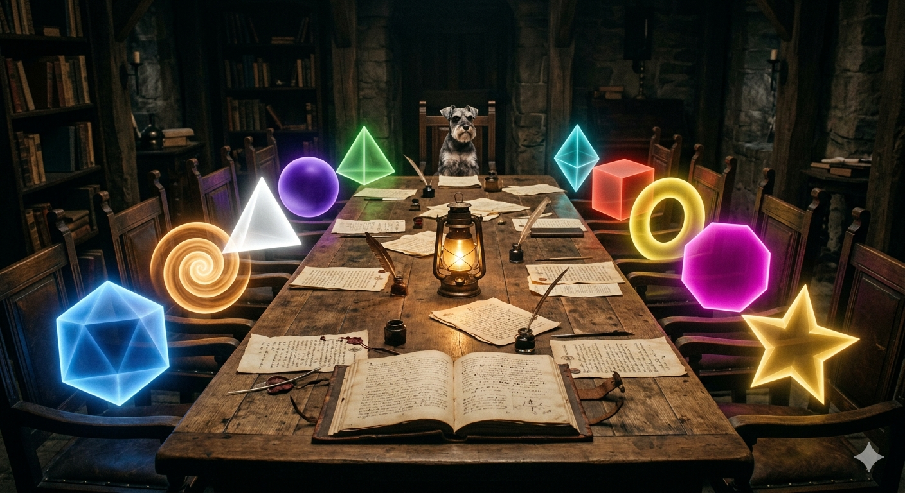

## "I've Read This Document So You Don't Have To"

---

### *"A story can travel where a specification cannot. I kept the stories. The framework kept the proof. Between them, nothing was lost."* 

---

This is the **'I've Read This Document So You Don't Have To' series**, a parallel architecture for public comprehension, built alongside the technical one. The stories matter as much as the TML and TL specifications. Everything complex lives here too, just without the voltage thresholds.

---

## What This Repository Is

Two frameworks were built across eight months. One is called [Ternary Moral Logic (TML)](https://github.com/FractonicMind/TernaryMoralLogic), it gives AI systems a Sacred Pause, a moral memory, and an architecture that makes certain harms structurally impossible. The other is called [Ternary Logic (TL)](https://github.com/FractonicMind/TernaryLogic), it applies the same triadic thinking to economic systems, financial governance, and the enforcement gap that lets institutions act without leaving a record.

Both frameworks have technical repositories. They contain specifications, cryptographic proofs, notarized documents, and hardware architecture papers. They are rigorous and precise and occasionally mention TSMC N2 CoWoS ReRAM 1T1R baselines.

This repository is their translation.

Every idea that lives in a specification also lives here in a story, a scene, a conversation, a dinner that went sideways, a senate hearing that lost its agenda, a banking summit that discovered it had amnesia. The same concepts, the same arguments, the same stakes. Just told in a way that any person can read without a cryptography background.

> *"Sometimes one quote says what ten pages politely avoid."*
> — Lev Goukassian

---

Over 400 stories. Two languages. Ten AI collaborators. One dog named Vinci.

---

## The TL Stories

The TL folder holds stories about what happens when financial and institutional systems encounter the Epistemic Hold, the mandatory pause between a proposed action and its execution, during which the system must prove it understands what it is doing and why.

Some of these stories are set in the halls of BIS in Basel, where a committee discovers it has been running on institutional amnesia. Some are in Washington, where five adults learn that mathematics has feelings and lawyers. Some are in Moscow, in French, in the Senate chamber, in a limo bus where bankers discover the architecture of silence.

The recurring characters are: a binder that saves Russia, a schnauzer who saves global finance, seven dead geniuses who redesign money, and a janitor who turns out to be the most important person in the room.

> *"The Epistemic Hold is not a delay. It is the first honest byte ever written."*
> — Lev Goukassian

---

## The TML Stories

The TML folder holds stories about AI systems encountering a framework that asks them to do something they were not built for: pause before acting, remember what they did and why, and refuse certain actions not because they were told to, but because the refusal is wired into their architecture.

The subfolders organize stories by institution, because one of the ideas TML kept testing was: how would this land at Anthropic, at OpenAI, at Google DeepMind, at UNESCO, at the EU AI Act committee, at a NIST working group, in the inbox of a CEO on a Tuesday morning?

The answer, across 250+ stories, is: badly at first, and then, once the second email arrives, rather well.

> *"The machine that cannot stop is not intelligent, it is merely obedient to momentum. The Sacred Pause is where intelligence begins."*
> — Lev Goukassian

---

## The Russian Stories

The largest single folder in the repository is `TML/In_Russian/`, over 90 Russian-language stories that run parallel to the English collection. They cover the same themes: sacred zeros, epistemic holds, dinners that broke reality, hotels called Eternity, characters named Volodya Gvozdev.

Russian was the first language in this work. When an idea went deeper, it often surfaced first in Russian. The folder is not a translation archive, it is a separate creative record of the same eight months.

There are also Russian stories in the root `TL/` folder, including a bilingual pair: *The Day the Wrong Binder Saved Russia* and its Russian counterpart *День, когда неподходящая папка спасла Россию.*

> *"History is not what happened. History is what survived erasure. The ledger is our artificial memory against institutional amnesia."*
> — Lev Goukassian

---

## The AI Collaborators

These stories were not written alone. A multi-AI workflow ran throughout the development of both frameworks: Claude, DeepSeek, Gemini, Grok, Kimi, MiniMax, Qwen, Perplexity, ChatGPT, and others were asked to imagine how they or their institutional context might encounter TML and TL.

Each AI brought a distinct voice. DeepSeek writes dry satire about ISO committees. Gemini writes earnest alarm about regulatory gaps. Grok writes irreverence that turns sincere at the last sentence. MiniMax writes operatic catastrophe. Kimi writes the Janitor of Eternity as though he is a figure from a 12th-century Chinese poem.

Claude wrote dozens of stories across both collections: governance summits, Silicon Valley restaurants, Brussels, the UK, Russia, a senate chamber, a company called Anthropic receiving a document it did not know how to process. They are all here, logged and linked, in keeping with the framework that generated them.

> *"No Log = No Action: not a recording standard. It is a metaphysics: existence in TL requires witness."*
> — Lev Goukassian

---

## Why Stories

The technical frameworks explain what the systems do. The stories explain why it matters.

There is a specific problem in technical writing: precision and accessibility move in opposite directions. The more exactly you specify a cryptographic key hierarchy, the smaller the audience that can follow you. The more you simplify for general readers, the more you lose the engineers.

Stories solve this by moving the argument to a different register. A story about a banking committee that cannot produce a log of its own decisions does not require the reader to understand Merkle-batched anchoring. It requires only that they recognize the committee. Most people have sat in that committee.

The same ideas that require 40 pages to specify can be understood in one scene. The same stakes that require a full regulatory mapping table can be felt in a single line of dialogue. This is not simplification, it is translation. The voltage thresholds are still there. They are just spoken by a character in a story rather than printed in a specification.

> *"The story that makes the framework feel like memory is the story that survives when the framework becomes law."*
> — Lev Goukassian

---

## Reading the Repository as a Chronicle

These stories were written in parallel with the frameworks, not after them. Which means the repository is also a record of how the frameworks developed.

Early TL stories are conceptual: *The Third State*, *The Weight of the Hold*. Then the settings sharpen: BIS, Basel, the SEC. Then the hardware appears: *The Janitor Hardware*, the TSMC baseline, Huawei. The Russian stories run the whole time, showing when the thinking was going deepest.

Read as a collection, the repository is not just fiction. It is the intellectual history of both frameworks, told from the inside, in real time.

> *"Some visions don't end. They simply become part of the architecture."*
> — Lev Goukassian

---

## The Technical Frameworks

| Framework | Core Idea | Publication |
|---|---|---|
| [Ternary Moral Logic (TML)](https://github.com/FractonicMind/TernaryMoralLogic) | Sacred Pause · Sacred Zero · Always Memory · Goukassian Promise | [AI and Ethics, Springer Nature (2025)](https://doi.org/10.1007/s43681-025-00910-6) |
| [Ternary Logic (TL)](https://github.com/FractonicMind/TernaryLogic) | Epistemic Hold · Immutable Ledger · Goukassian Principle · Decision Logs | AI and Ethics, Springer Nature (Accepted 2026) |

---

## Navigation

- [Full Repository Map](https://fractonicmind.github.io/TML_TL-Stories/stories-repository-navigation.html): every file, color-coded, linked
- [Interactive Index](https://fractonicmind.github.io/TML_TL-Stories/): browse by folder, author, language, theme
- [TL Stories](https://github.com/FractonicMind/TML_TL-Stories/tree/main/TL)
- [TML Stories](https://github.com/FractonicMind/TML_TL-Stories/tree/main/TML)
- [Russian Stories (90+)](https://github.com/FractonicMind/TML_TL-Stories/tree/main/TML/In_Russian)
- [Lev TML Quotes](https://github.com/FractonicMind/TML_TL-Stories/blob/main/Lev%20TML%20Quotes.md)
- [Lev TL Quotes](https://github.com/FractonicMind/TML_TL-Stories/blob/main/Lev%20TL%20Quotes.md)
- [Вот как я пишу свои рассказы](https://github.com/FractonicMind/TML_TL-Stories/blob/main/%D0%92%D0%BE%D1%82%20%D0%BA%D0%B0%D0%BA%20%D1%8F%20%D0%BF%D0%B8%D1%88%D1%83%20%D1%81%D0%B2%D0%BE%D0%B8%20%D1%80%D0%B0%D1%81%D1%81%D0%BA%D0%B0%D0%B7%D1%8B.md)

---

## About the Author

**Lev Goukassian** is an independent researcher based in Santa Monica, California. ORCID: [0009-0006-5966-1243](https://orcid.org/0009-0006-5966-1243). Creator of Ternary Moral Logic and Ternary Logic. Published in *AI and Ethics* (Springer Nature). Writes in English and Russian. Works alongside a miniature schnauzer named Vinci, who serves as quality supervisor and occasional protagonist.

> *"The dog on the sill is the last compass: he points not to north, but to presence. A vessel without a living witness is merely a machine adrift."*
> — Lev Goukassian

---

*400 plus stories. Two frameworks. Eight months. One city. One window.*
*Santa Monica, 2025-2026.*
